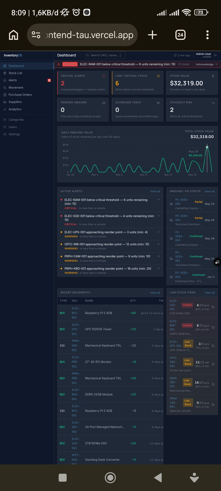

# InventoryOS

A full-stack inventory management system — real database, real auth, real-time stock updates.
Built as a portfolio project demonstrating production-level full-stack engineering.

[](https://github.com/legacyasphere-id/MINI-ERP/actions/workflows/ci.yml)
[](https://mini-erp-frontend-tau.vercel.app)
[](https://www.typescriptlang.org/)
[](https://react.dev/)
[](https://expressjs.com/)
[](https://www.prisma.io/)

> **Demo credentials:** `admin@inventoryos.com` / `password123`

---

## Preview



---

## What's Inside

### Core Features
- **JWT Authentication** — bcrypt password hashing, stateless tokens, protected routes on both frontend and backend
- **Live Stock Tracking** — every movement (receive, issue, transfer, adjust) atomically updates `currentQty` in a single Prisma transaction
- **Movement Log** — paginated, filterable log with SKU cross-links to product detail
- **Purchase Orders** — multi-line POs with per-line receive quantities and status lifecycle (`draft → confirmed → partial → received`)
- **Alerts Center** — acknowledgeable alerts with severity tiers (critical / warning / info) and full audit trail
- **Suppliers** — directory with linked PO history and reliability scores
- **Analytics** — 30-day inbound value chart, top-movement SKUs, stock health breakdown
- **User Management** — invite users, assign roles (Admin / Manager / Staff), live role update

### Engineering Highlights
- **Custom design system** — Tailwind CSS tokens (`text-ink`, `text-status-ok`, `bg-surface-card`, etc.) for consistent theming without a component library
- **Bundle optimisation** — manual vendor chunks + lazy-loaded chart pages bring initial JS from 829 KB → 162 KB (gzip 235 KB → 47 KB)
- **Accessibility** — ARIA labels, `role="dialog"` on modals, `scope="col"` on tables, `aria-pressed` on filter tabs, `role="alert"` on errors
- **Error resilience** — React `ErrorBoundary`, `QueryCache`/`MutationCache` global handlers, per-operation toast feedback
- **Loading states** — skeleton screens on every table and KPI grid instead of blank flashes
- **Strict TypeScript** — `"strict": true`, `noUnusedLocals`, `noUnusedParameters` on both packages; zero `any` types

---

## Tech Stack

| Layer       | Technology                                          |
|-------------|-----------------------------------------------------|
| Frontend    | React 18, TypeScript, Vite, Tailwind CSS            |
| Routing     | React Router v6                                     |
| Server state | TanStack Query v5, Axios                           |
| Backend     | Express 4, TypeScript, tsx                          |
| Database    | PostgreSQL (Supabase) + Prisma ORM                  |
| Auth        | JWT (`jsonwebtoken`), bcrypt                        |
| Validation  | Zod (backend), native form validation (frontend)    |
| Deployment  | Vercel (frontend + serverless API), Supabase (DB)   |

---

## Project Structure

```
mini-erp/
├── frontend/                  # React + Vite SPA
│   ├── src/
│   │   ├── components/        # Layout, UI primitives, feature components
│   │   ├── pages/             # One file per route
│   │   ├── services/          # Axios API clients (one per resource)
│   │   ├── store/             # Zustand stores (alerts, UI)
│   │   ├── hooks/             # useAuth, useProducts
│   │   ├── lib/               # cn, dates, formatters, toast, constants
│   │   └── types/             # Shared TypeScript types
│   └── vite.config.ts         # Manual chunks, dev proxy
├── backend/
│   └── src/
│       ├── controllers/       # Request handlers
│       ├── services/          # Business logic + Prisma queries
│       ├── routes/            # Express routers
│       └── middleware/        # JWT auth, error handler
├── prisma/
│   ├── schema.prisma          # Data model
│   └── seed.ts                # Demo data seed
└── package.json               # npm workspace root
```

---

## Quick Start (Local)

### Prerequisites
- Node.js ≥ 20
- PostgreSQL 15+ (or a Supabase project)

### Steps

```bash
# 1. Install all dependencies
npm install

# 2. Configure environment
cp .env.example .env
# Set DATABASE_URL and JWT_SECRET in .env

# 3. Run migrations and seed demo data
DATABASE_URL="<your-db-url>" node_modules/.bin/prisma migrate dev
DATABASE_URL="<your-db-url>" node_modules/.bin/tsx prisma/seed.ts

# 4. Start both dev servers
npm run dev
```

| Server    | URL                       |
|-----------|---------------------------|
| Frontend  | http://localhost:5173     |
| Backend   | http://localhost:3001     |

### Available Scripts

| Command                | Description                              |
|------------------------|------------------------------------------|
| `npm run dev`          | Start frontend + backend concurrently    |
| `npm run dev:frontend` | Vite dev server only                     |
| `npm run dev:backend`  | Express server only (with hot-reload)    |
| `npm run build`        | Production build (tsc + vite)            |
| `npm run lint`         | ESLint on both packages                  |

---

## API Reference

All endpoints except `/api/auth/login` require `Authorization: Bearer <token>`.

| Method | Path                        | Description                            |
|--------|-----------------------------|----------------------------------------|
| POST   | `/api/auth/login`           | Login → returns JWT + user             |
| GET    | `/api/auth/me`              | Current user from token                |
| GET    | `/api/products`             | List products (search, status, page)   |
| GET    | `/api/products/:id`         | Single product with category           |
| GET    | `/api/products/:id/movements` | Movement history for a SKU           |
| GET    | `/api/movements`            | Paginated movement log                 |
| POST   | `/api/movements`            | Record a stock movement                |
| GET    | `/api/orders`               | Purchase orders (filterable)           |
| POST   | `/api/orders`               | Create a PO                            |
| POST   | `/api/orders/:id/receive`   | Receive PO lines                       |
| GET    | `/api/suppliers`            | Supplier list with linked POs          |
| GET    | `/api/dashboard/stats`      | KPIs + 30-day chart data               |
| GET    | `/api/analytics`            | Stock health + top SKUs                |
| GET    | `/api/settings`             | App settings singleton                 |
| PUT    | `/api/settings`             | Update settings                        |
| GET    | `/api/users`                | User list                              |
| POST   | `/api/users`                | Create user                            |
| PATCH  | `/api/users/:id/role`       | Update user role                       |

---

## Deployment Notes

The app is deployed on **Vercel** with the backend as serverless functions and the database on **Supabase PostgreSQL**.

Key config for Supabase + Vercel:
- Use the **Session Pooler** URL (port 5432) — Vercel is IPv4-only, Supabase's direct connection is IPv6
- Add `?pgbouncer=true` is NOT needed for Session Pooler (only Transaction Pooler)
- `prisma` must be in `dependencies` (not `devDependencies`) so Vercel installs it
- Add `"postinstall": "prisma generate"` to `backend/package.json`

---

## License

MIT
